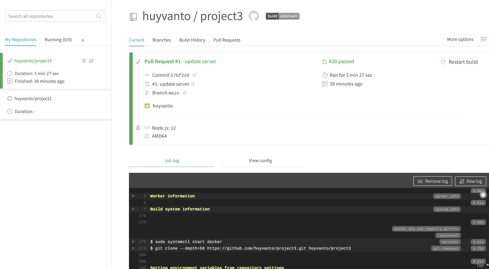
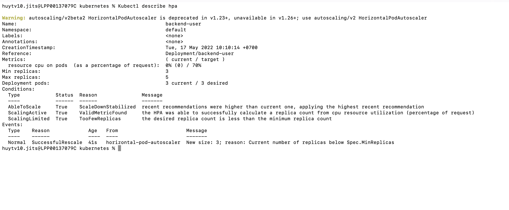

README: 
Link Github: https://github.com/huyvanto/project3/tree/dev

1 Docker images in your repository in DockerHub:

2 TravisCI build pipeline showing successful build jobs:

3 Kubernetes kubectl get pods output:

4 The output of kubectl describe services does not expose any sensitive strings such as database passwords.

5 Screenshot of Kubernetes services shows a reverse proxy

6 Screenshot of Kubernetes cluster of command kubectl describe hpa has autoscaling configured with CPU metrics.

7 Screenshot of one of the backend API pod logs indicates user activity that is logged when an API call is made.

